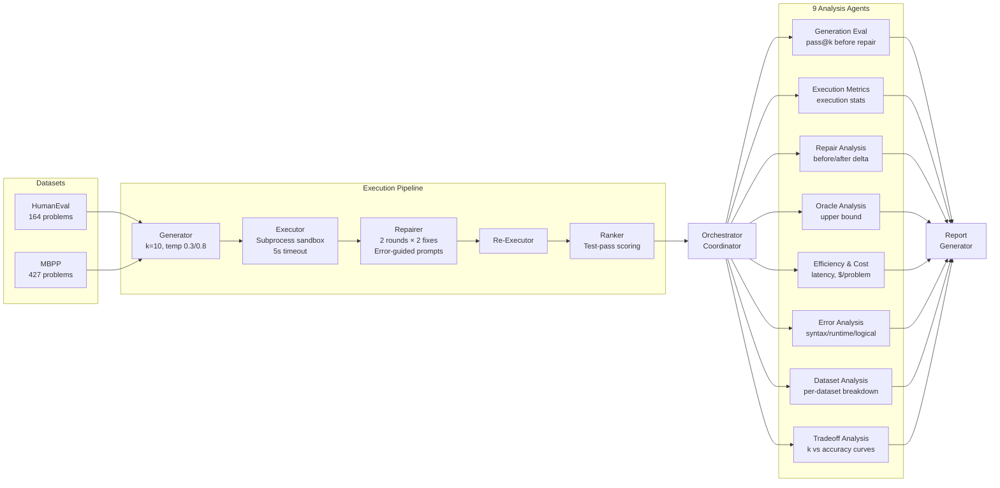

# 🧠 Multi-Agent Evaluation System — Walkthrough

## System Architecture



## Files Created

| Module | File | Purpose |
|--------|------|---------|
| Config | [config.py](file:///c:/Research/SLM-Agent/config.py) | Experiment parameters (k, temps, repair rounds) |
| Datasets | [humaneval_loader.py](file:///c:/Research/SLM-Agent/datasets/humaneval_loader.py) | Auto-download & parse HumanEval |
| Datasets | [mbpp_loader.py](file:///c:/Research/SLM-Agent/datasets/mbpp_loader.py) | Auto-download & parse sanitized MBPP |
| Pipeline | [generator.py](file:///c:/Research/SLM-Agent/pipeline/generator.py) | k-candidate generation via vLLM API |
| Pipeline | [executor.py](file:///c:/Research/SLM-Agent/pipeline/executor.py) | Sandboxed subprocess execution with error classification |
| Pipeline | [repairer.py](file:///c:/Research/SLM-Agent/pipeline/repairer.py) | Error-guided repair loop with LLM |
| Pipeline | [ranker.py](file:///c:/Research/SLM-Agent/pipeline/ranker.py) | Test-pass-rate ranking & selection |
| Agents | [base_agent.py](file:///c:/Research/SLM-Agent/agents/base_agent.py) | Abstract agent with unbiased pass@k estimator |
| Agents | [orchestrator.py](file:///c:/Research/SLM-Agent/agents/orchestrator.py) | Central coordinator, runs pipeline + all agents |
| Agents | [generation_eval.py](file:///c:/Research/SLM-Agent/agents/generation_eval.py) | pass@k before repair |
| Agents | [execution_metrics.py](file:///c:/Research/SLM-Agent/agents/execution_metrics.py) | Execution statistics |
| Agents | [repair_analysis.py](file:///c:/Research/SLM-Agent/agents/repair_analysis.py) | Repair effectiveness + diminishing returns |
| Agents | [oracle_analysis.py](file:///c:/Research/SLM-Agent/agents/oracle_analysis.py) | Upper bound (any candidate passes) |
| Agents | [efficiency_cost.py](file:///c:/Research/SLM-Agent/agents/efficiency_cost.py) | Latency breakdown, GPU cost model |
| Agents | [error_analysis.py](file:///c:/Research/SLM-Agent/agents/error_analysis.py) | Error type distribution + repairability |
| Agents | [dataset_analysis.py](file:///c:/Research/SLM-Agent/agents/dataset_analysis.py) | Per-dataset (HumanEval/MBPP) breakdown |
| Agents | [tradeoff_analysis.py](file:///c:/Research/SLM-Agent/agents/tradeoff_analysis.py) | k vs accuracy, repair rounds vs gain |
| Report | [report_generator.py](file:///c:/Research/SLM-Agent/report/report_generator.py) | Structured markdown report |
| Main | [main.py](file:///c:/Research/SLM-Agent/main.py) | CLI entry point with dry-run support |

## Usage

### 1. Dry-Run (test system without LLM — already validated ✅)
```bash
python main.py --dry-run
```

### 2. Full Evaluation (requires running vLLM server)
```bash
# Terminal 1: Start vLLM
bash vllmRunner.sh

# Terminal 2: Run evaluation
python main.py --datasets humaneval mbpp
```

### 3. Custom Parameters
```bash
python main.py --k 5 --repair-rounds 3 --temperatures 0.2 0.6 0.9
```

### 4. Re-analyze from saved data
```bash
python main.py --from-data results/pipeline_data.json
```

## Dry-Run Report (Validated)

The system was tested with synthetic data and produced a complete report:

render_diffs(file:///c:/Research/SLM-Agent/results/evaluation_report.md)

## Output Files

All 11 output files in `results/`:

| File | Size | Contents |
|------|------|----------|
| `evaluation_report.md` | 5 KB | Structured markdown report |
| `full_results.json` | 422 KB | All agent outputs combined |
| `pipeline_data.json` | 2 MB | Raw per-problem pipeline data |
| `generation_eval.json` | 142 KB | Per-problem pass@k |
| `execution_metrics.json` | 112 KB | Per-problem execution stats |
| `oracle_analysis.json` | 100 KB | Per-problem oracle data |
| `repair_analysis.json` | 1 KB | Aggregate repair metrics |
| `error_analysis.json` | 2 KB | Error distribution |
| `dataset_analysis.json` | 1 KB | Per-dataset breakdown |
| `tradeoff_analysis.json` | 2 KB | Scaling curves |
| `efficiency_cost.json` | 1 KB | Cost metrics |

## Key Design Decisions

1. **Unbiased pass@k** — Uses the Chen et al. 2021 (Codex) estimator: `1 - C(n-c, k) / C(n, k)`
2. **Sandboxed execution** — Each candidate runs in an isolated subprocess with timeout
3. **Error classification** — Stderr analysis to distinguish syntax / runtime / logical / timeout
4. **GPU cost model** — Self-hosted vLLM uses time-based GPU cost ($2.50/hr default)
5. **Agent coordination** — Sequential pipeline: data flows from orchestrator → agents → report
